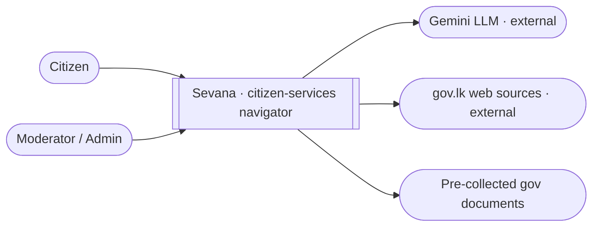
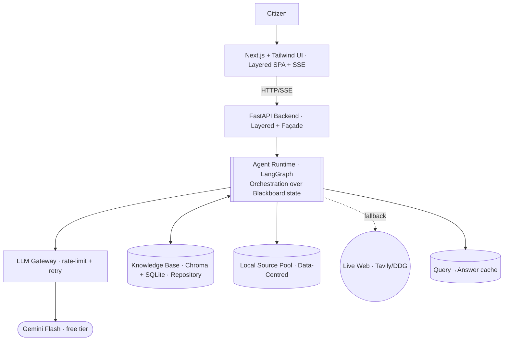
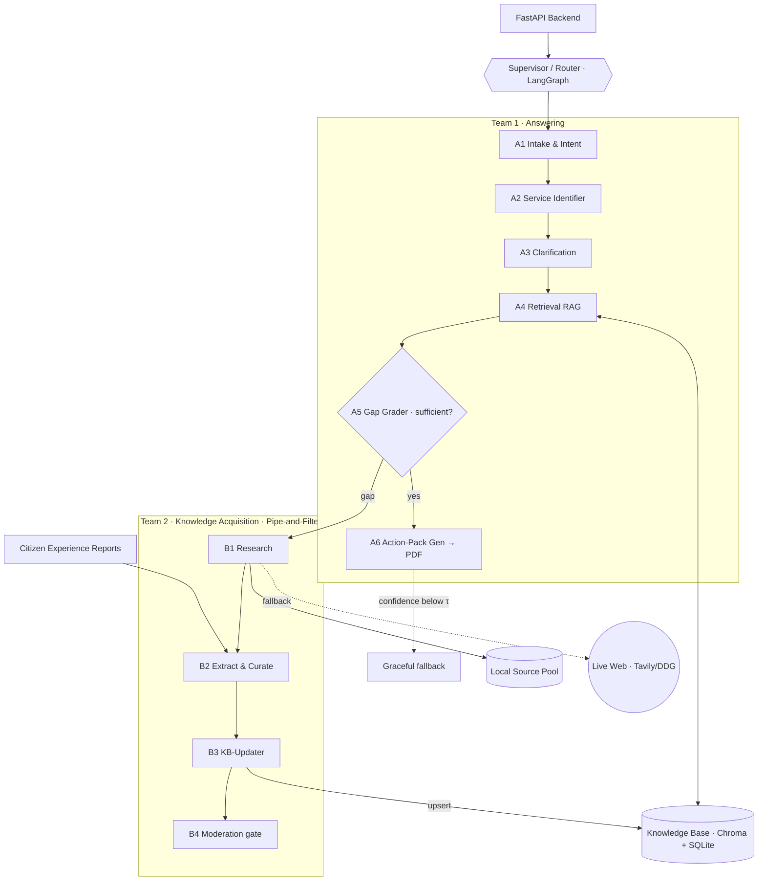

# 02 · Architecture

> Decisions here are driven by the quality attributes in
> [00-architecture-drivers.md](00-architecture-drivers.md) and logged with their trade-offs in
> [09-architecture-decisions.md](09-architecture-decisions.md). The system is described with the
> **C4 model** (Context → Container → Component); we use the first three zoom levels.

## Architectural style — a justified hybrid

No single style fits the whole system, so each part uses the style that best serves its dominant
driver (the "rice-and-curry plate of styles" from the workshop). Naming them makes the design
defensible.

| Style | Where it is used | Driver it serves |
|---|---|---|
| **Orchestration (Supervisor)** | Control flow across agents (the LangGraph supervisor) | Correctness, traceability (QA-1, QA-8) |
| **Blackboard / Data-Centred** | The shared `GraphState` every agent reads/writes | Traceability (QA-8) |
| **Pipe-and-Filter** | The acquisition pipeline `B1 → B2 → B3` (research → curate → embed/upsert) | Extensibility (QA-5) |
| **Layered** | Backend: API → orchestration → agents → RAG/tools → data | Modifiability, security (QA-4, QA-7) |
| **Repository / Data-Centred** | The Knowledge Base (Chroma + SQLite) and the Source Pool | Correctness, availability (QA-1, QA-6) |

It is **orchestrated, not event-driven** — there is no message bus; the supervisor decides every
hop. That is a deliberate choice for a single-node 12-hour build (see [AD-11](09-architecture-decisions.md)).

## Pattern decision — Hierarchical multi-agent (Supervisor + 2 teams)

**Decision & technology:** A **hierarchical multi-agent system** built on **LangGraph**. A single
top-level **Supervisor/Router** coordinates two specialised teams:
- **Team 1 — Answering** (the synchronous citizen-facing path): `A1 … A6`.
- **Team 2 — Knowledge Acquisition** (triggered only on a knowledge gap): `B1 … B4`.

We deliberately stop at **two levels** (supervisor → team → workers); no supervisor-of-supervisors.

### Alternatives considered
| Pattern | Why not (for this problem, in 12 h) |
|---|---|
| Single ReAct agent + tools | The self-expanding loop + branching interview are hard to keep correct, debug, and defend inside one agent. |
| Fixed sequential pipeline | Cannot express the dynamic "gap → research → retry" loop. |
| Network / swarm (free agent-to-agent) | Cost and control are unpredictable; dangerous under free-tier rate limits; hard to explain in the technical defense. |
| Supervisor-of-supervisors (deep hierarchy) | Over-engineered for 12 h; more failure surface than payoff. |

### Why this is optimal
- **Separation of concerns** — "answer the citizen" vs. "grow the knowledge" map to two teams,
  which is exactly the [per-agent documentation](agents/README.md) the rubric/defense rewards.
- **Controllable, bounded loops** — the gap→research→retry loop is an explicit, capped edge in a
  state graph, which protects the free-tier quota.
- **Parallel development** — two teams let two people build simultaneously within 12 h.
- **Defensible** — the graph is traceable and visual, ideal for "explain your logic and AI
  workflows" in the post-event review.

## C4 Level 1 — System Context

The widest view: Sevana as one box, the people who use it, and the external systems it depends on.



People use the system in the middle; it delegates reasoning to Gemini and pulls evidence from
official sources.

## C4 Level 2 — Containers

The deployable pieces, each tagged with the style it leans on (justified in
[00 · dominant driver per container](00-architecture-drivers.md#dominant-driver-per-container)).



The customer's critical path (browse → ask → answer) is **synchronous**; progress during the slow
gap-fill is pushed to the UI over **SSE** so the wait is always visible (QA-2).

## C4 Level 3 — Components (the agent graph)

Opening the **Agent Runtime** container: the supervisor and the two agent teams, plus the stores
they touch.



## Component responsibilities (one line each)
| Component | Responsibility |
|---|---|
| **Next.js UI** | Chat, clarifying-question cards, Action-Pack view + print/PDF, experience-report form |
| **FastAPI** | HTTP/SSE API, session lifecycle, invokes the LangGraph app |
| **Supervisor** | Routes the conversation; decides next node; enforces the gap-loop cap |
| **Team 1 (A1–A6)** | Understand → identify → clarify → retrieve → grade → generate answer |
| **Team 2 (B1–B4)** | Research → curate → write back to KB → (moderate) |
| **Knowledge Base** | ChromaDB (vectors) + SQLite (structured records, provenance) |
| **Local Source Pool** | Pre-collected gazettes / circulars / portal PDFs the Research agent searches first |

See per-agent detail in [agents/](agents/README.md).

## Ports & interfaces (the C4-L3 "sockets")

Agents depend on **interfaces, not implementations** — this is what makes the modifiability claim
(QA-4) structural rather than aspirational and what the hexagonal layout in
[04-tech-stack-and-decisions.md](04-tech-stack-and-decisions.md#repository-layout-hexagonal) enforces.

| Port (provided interface) | Contract (the socket) | Adapters that implement it |
|---|---|---|
| `LLMProvider` | `complete(prompt, schema?) -> str \| Model` | Gemini Flash · (Groq fallback) |
| `EmbeddingProvider` | `embed(texts) -> vectors` | local `bge-base-en-v1.5` |
| `KnowledgeStore` / `Retriever` | `search(query, filters) -> chunks`; `upsert(records)` | Chroma + SQLite |
| `WebSearch` | `search(query, allowlist) -> results` | Tavily · `ddgs` |
| `SourceParser` | `parse(bytes \| url) -> clean_text + meta` | PyMuPDF · trafilatura |

Swapping any provider behind these ports leaves agent logic untouched (Gemini→Groq, Chroma→pgvector).

## Design patterns applied

Naming the patterns we already use turns them into defense points (per the workshop's pattern table).

| Pattern | Where in Sevana | Why |
|---|---|---|
| **Strategy** | `LLMProvider`, `WebSearch`, the A5 grader (threshold vs LLM) | Swap the method without touching callers |
| **Adapter** | Each external API (Gemini, Tavily) behind a common port | Make an incompatible external API fit one interface |
| **Façade** | FastAPI calls one `graph.invoke()` over the whole multi-agent subsystem; the LLM gateway over Gemini | One clean call hides a messy subsystem |
| **Repository** | `KnowledgeStore` over SQLite + Chroma | Hide the storage choice from agents |
| **State** | Supervisor routing over `GraphState` transitions | Make illegal transitions impossible; rules in one place |
| **Pipe-and-Filter** | `B1 → B2 → B3` acquisition pipeline | Independent, swappable curation stages |

## State management (LangGraph)

A single typed `GraphState` flows through the graph and is **persisted with a checkpointer**
(`SqliteSaver`) per `thread_id` (= chat session), so the clarifying interview can pause for user
input and resume.

```python
class GraphState(TypedDict):
    session_id: str
    user_query: str
    intent: dict                  # A1 → {service_guess, entities}
    service_id: str | None        # A2
    variant_id: str | None        # A3 (after slots filled)
    slots: dict                   # A3 collected answers (branch, district, ...)
    pending_question: str | None  # A3 → UI; None when complete
    retrieved: list[dict]         # A4 chunks + scores + source ids
    grade: str                    # A5: "SUFFICIENT" | "GAP"
    answer_confidence: float      # A5/A6: min confidence of facts to be served (gate, see below)
    acquisition_loops: int        # guardrail counter (cap N, e.g. 2)
    answer: dict | None           # A6 structured Action Pack
    citations: list[dict]         # source id, title, url, last_verified
```

**Decision:** keep one flat, **lean** state object + a checkpointer.
**Alternatives:** per-agent local memory (harder to trace); external Redis (overkill for 12 h).
**Why optimal:** one inspectable state = easy debugging, easy demo, easy technical defense; the
SQLite checkpointer is zero-infrastructure and resumable.
**Keep it lean (AD-3):** the state is checkpointed on every node, so heavy artifacts (e.g. the full
text of `retrieved` chunks) should be held by reference (`source_id` + `vector_ref`) rather than
copied into the persisted state, which is otherwise written in full on each step.

## Cross-cutting concerns

**Correctness & trust (QA-1)**
- **Confidence-gated serving (AD-8)** — `verification_status` decides the *label*; `confidence`
  decides whether to *answer at all*. A6 will not render `auto_gathered` facts whose confidence is
  below the threshold `τ` (see [05-data-model.md](05-data-model.md#confidence-serving-gate)) — it
  falls back instead. A label does not stop a bad answer; this gate does.
- **Provenance** — every retrieved fact carries `source_id`, `last_verified`, and a
  `verification_status` (`verified` vs `auto_gathered`).
- **Moderation gate (B4)** — `auto_gathered` knowledge is served "pending verification" and queued
  for a human to promote to `verified`.

**Availability & bounds (QA-6, QA-3)**
- **Loop cap** — `acquisition_loops ≤ N` (default 2); on exhaustion → graceful fallback
  ("couldn't verify; here is the office to contact directly").
- **Source allow-list (QA-7)** — live web restricted to `*.gov.lk` and known official domains.

**Cost & responsiveness (QA-3, QA-2)**
- **Central LLM gateway (AD-10)** — all agents call Gemini through one rate-limited gateway
  (token-bucket + retry/backoff) so the multi-agent system stays under the free-tier ceiling.
- **Query→answer cache (AD-12)** — identical `service+variant+district` queries skip the graph;
  invalidated for that key on KB upsert.
- **AI-workflow efficiency** — A1+A2 may be merged into one LLM call; the grader uses a cheap/fast
  call; embeddings are computed locally (see
  [04-tech-stack-and-decisions.md](04-tech-stack-and-decisions.md)).
- **SSE progress streaming** — agent-step events are streamed to the UI during the slow gap-fill so
  the citizen sees progress, never a silent hang.

**Observability (QA-8)**
- **Tracing** — LangSmith (or structured logs) with a per-session correlation id follows every
  agent step and tool call for the technical defense.
