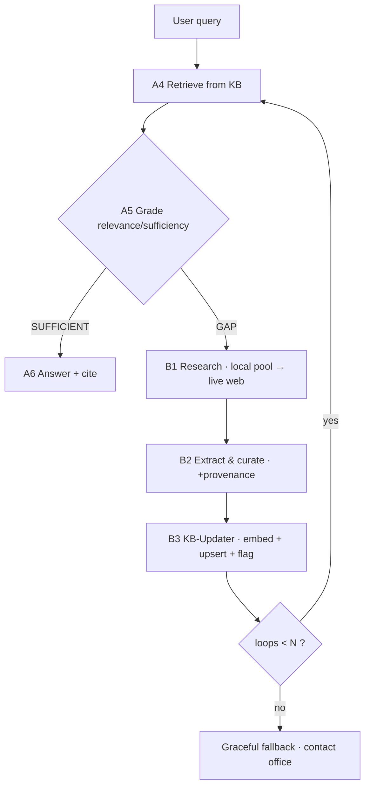

# 03 · Self-Expanding RAG (the Knowledge-Gap Loop)

This is the core innovation. It directly answers the constraint: **we cannot pre-build a knowledge
base for the entire government domain, so the knowledge base must grow itself on demand.**

Academically this is **Corrective RAG (CRAG) + lazy / on-demand knowledge ingestion**.

## The loop

1. **Retrieve** (A4) — query the existing KB (vector + structured).
2. **Grade** (A5) — judge whether the retrieved context actually answers the query.
   Output `SUFFICIENT` or `GAP`.
3. On **GAP**:
   - **B1 Research** — formulate search queries; **search the local source pool first**, then fall
     back to **live web** (Tavily / DuckDuckGo, restricted to `*.gov.lk`). Fetch + parse PDFs/pages.
   - **B2 Extract & Curate** — convert raw text into canonical records (service, requirements, fees,
     office) with **source provenance + `retrieved_date`**; validate against the schema.
   - **B3 KB-Updater** — dedup, chunk, embed, and **upsert** into ChromaDB + SQLite; tag
     `confidence` and `verification_status = auto_gathered`.
   - **Re-retrieve** — loop back to step 1 (now the new knowledge is present), **bounded by `N`**.
4. The answer from newly-gathered knowledge is **labelled "newly gathered, pending verification"**
   with its sources, so trust stays honest.

## Why this beats the alternatives

| Alternative | Problem |
|---|---|
| Static pre-built KB only | Never complete for a huge domain; goes stale. |
| Web search on every query (no KB) | Slow; blows free-tier rate limits; no learning; repeats the same work for every user. |
| GraphRAG / knowledge graph | Powerful for relations but too heavy to build in 12 h. |
| Fine-tuning the model | Paid, static, and breaks the free-tier rule. |
| **Cached KB + on-demand corrective acquisition (chosen)** | KB grows **lazily, only where real users need it**; the first user's research is cached for everyone after — fresh, free-tier-efficient, and a genuine **data moat**. |

## Demo strategy (reliability + drama)
- **Seed** Land Deed Transfer + NIC → instant, polished answers (`SUFFICIENT` path).
- **Live gap-fill** on **Business Name Registration** (unseen) → the judge's query triggers the full
  loop and the KB visibly grows during the demo.
- **Hybrid source** makes this reliable: the local pool already contains a couple of (not-yet-ingested)
  sources for the gap-fill service, so B1 always finds something locally; live web is the impressive
  fallback.

## Guardrails
- `acquisition_loops ≤ N` (default **2**) prevents infinite loops and runaway cost.
- **Source allow-list** prevents ingesting junk/unofficial pages.
- **Moderation gate (B4)** — `auto_gathered` knowledge is served with a "pending verification" label
  and queued for a human moderator to promote to `verified`.
- **Dedup on upsert** — avoids re-ingesting the same source twice.

## Same pipeline, second source: experience reports
Citizen **experience reports** ("info was correct" / "they also asked for X") flow into the **same
B2 → B3** pipeline, so the system improves from real-world outcomes, not only web research.
