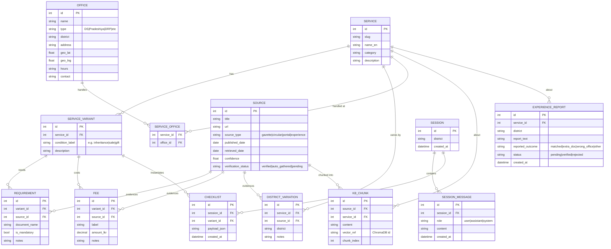

# 05 · Data Model (ER)

**Decision:** a relational schema in **SQLite** for structured facts + provenance, mirrored into
**ChromaDB** for vector retrieval. The relational layer is the source of truth and gives the
**ER diagram** the report requires.

**Why optimal:** structured records make the Action Pack deterministic (exact fees, exact office),
while the vector store powers fuzzy natural-language retrieval. Provenance lives on every record so
answers can cite a dated source.

## ER diagram

## Entity notes
- **SERVICE_VARIANT** is what makes the branching interview possible — the agent narrows from a
  service to a single variant before answering.
- **SOURCE** carries `verification_status`, so self-expanded (`auto_gathered`) knowledge is visibly
  distinct from `verified` knowledge.
- **KB_CHUNK.vector_ref** links a structured record to its ChromaDB vector — provenance both ways.
- **EXPERIENCE_REPORT** is both a feedback record and a future SOURCE (after moderation).

## Confidence serving gate

`SOURCE` carries two **independent** trust signals that must not be conflated:

| Field | Decides | Used by |
|---|---|---|
| `verification_status` (`verified` / `auto_gathered` / `pending`) | the **label** shown to the citizen | A6 sets the Action-Pack `verification` field |
| `confidence` (0–1) | whether to **answer at all** | A6 / supervisor — the serving gate |

**The gate (AD-8, QA-1):** a *label* does not stop a *bad* answer. Before A6 renders an Action Pack
from `auto_gathered` facts, the supporting facts' `confidence` is compared to a threshold `τ`
(default **0.6**, a single tunable constant):

- `confidence ≥ τ` → render the Action Pack, labelled "newly gathered, pending verification".
- `confidence < τ` → **do not render**; return the graceful fallback ("found a related source but
  couldn't verify it — here is the office to contact directly").

`verified` facts bypass the gate. This is what prevents a weak page scraped during the live gap-fill
from becoming a confidently-wrong government answer on stage. The trade-off (occasionally refusing a
correct-but-low-confidence find) is accepted: under-answering beats misleading.

**What "the supporting facts" means (as-built, Stage 7).** The gate reads the sources behind the
`REQUIREMENT` and `FEE` rows A6 is about to render — not the chunks A4 retrieved. The two diverge:
A6 assembles the pack deterministically from store rows, each carrying its own `source_id`, while
retrieval returns the nearest chunks, which may include crawled text that contributed nothing to the
answer. Judging on retrieval meant a single stray low-confidence chunk could suppress a checklist
built entirely from `verified` rows — routinely so after a `merge-services` run repoints crawled
chunks onto a curated service.

This is not a loosening of AD-8. Nothing `auto_gathered` below `τ` is served, the label still tracks
the provenance of the rows shown, and one case the old gate missed is now refused outright: a variant
with **no sourced rows at all** used to yield an empty checklist wearing a `verified` badge. The
`ActionPack` `citations` come from the same set, which is what makes the UI's promise — "every
requirement above is based on these official sources" — literally true.

### Unofficial sources (`is_official`, Stage 7)

Some requests have no page on any `gov.lk` domain, and B1's allow-listed search then returns nothing
— a dead end for the citizen and for the gap loop. With `WEB_FALLBACK_UNRESTRICTED=true`, B1 runs a
**second tier** without the allow-list, and records what it finds as `is_official = 0`.

`is_official` is a **third, independent** signal. `verification_status` is whether a human approved
it; `confidence` is how sure the extraction is; `is_official` is *where it came from*. A moderator
needs the third one: a confidently-extracted blog post and a confidently-extracted gazette look
identical without it, and the queue now labels the difference.

**Source authority (B2).** `confidence = authority × extraction_certainty`, and the authority now
splits official from unofficial web: `WEB_OFFICIAL_AUTHORITY` (0.75) vs `WEB_UNOFFICIAL_AUTHORITY`
(0.5). So a well-extracted **official** (allow-listed, e.g. `gov.lk`) find lands around 0.68 — above
`τ` — and is **served immediately, labelled "pending verification"** until a human confirms it,
rather than dropping to the bare fallback. An unofficial find lands around 0.45 and, capped again by
`UNOFFICIAL_MAX_CONFIDENCE` below, stays under the gate.

Unofficial sources are capped at `UNOFFICIAL_MAX_CONFIDENCE` (0.5), deliberately below `τ`, however
confident B2 was. So the serving gate above always refuses them: they can enter the knowledge base
and be retrieved, but they cannot render a checklist. The only route from "found on the web" to
"served as fact" runs through a human promoting it in the moderation queue.

### Search tiers (B1)

B1 searches official domains in order, de-duplicated by URL: a **priority tier**
(`WEB_PRIORITY_DOMAINS`, default `documents.gov.lk` — the gazette/acts portal) so
authoritative legal sources surface first, then the full **allow-list**
(`WEB_ALLOWLIST`, default `gov.lk,parliament.lk`; `gov.lk` already covers every
`*.gov.lk` subdomain, the gazette included). Only when *nothing* official is found
does the gated **unrestricted tier** run (see above). All of it is env-configurable.

### Linked PDFs (`WEB_PDF_FETCH`, Stage 7)

A web search returns a link and a one-line snippet. For a government **PDF** — a form, circular or
gazette — that snippet is a poor proxy for the document. With `WEB_PDF_FETCH=true` (default), B1
downloads a result whose URL ends in `.pdf` and extracts its full text with the same PyMuPDF parser
the local source pool uses, so B2 curates from the real requirements rather than a preview. The
fetcher is deliberately narrow and defensive — PDF-only, `http(s)` only, a size cap read during
download, a `%PDF` magic-byte check (an HTML error page served at a `.pdf` URL is rejected), and a
text cap so a large document cannot blow the LLM prompt. Any failure degrades to the snippet; a
gap-fill never crashes on a bad link. HTML full-page fetch remains snippet-only for now.

## Alternatives considered
| Alternative | Why not |
|---|---|
| Vectors only (no relational) | Fees/office must be exact and queryable, not fuzzy — needs structured rows. |
| Single Postgres + pgvector | Heavier setup; SQLite + Chroma is faster to stand up in 12 h (Postgres is the post-event upgrade). |
| NoSQL document store | Loses the clean relational ER the report wants and the join-based district/variant logic. |

## Domain mapping note (as-built)

The pure domain dataclasses in `backend/app/domain/entities.py` mirror this ER, with two intentional
differences (full log in [10-backend-implementation.md](10-backend-implementation.md)):
- `OFFICE.type` is named **`office_type`** in code (avoids shadowing the `type` builtin).
- The domain adds runtime **value objects** that are not tables: `RetrievedChunk` (A4 retrieval
  result), the `ActionPack` family (A6's structured, cited answer), and an `ActionPackVerification`
  label enum. `CHECKLIST` is the persisted form, modeled as `StoredChecklist`.
- The SQLite schema (`backend/app/adapters/knowledge/schema.sql`) adds a `source.content_hash`
  column for B3 dedup (not in the ER), and stores `fee.amount_lkr` as TEXT to preserve `Decimal`
  precision.
- `SOURCE.verification_status` gains a fourth value **`rejected`** (Stage 6b): when a moderator
  rejects an auto-gathered source it is **quarantined** — its chunks are de-indexed (no longer
  retrieved/served) and it drops out of the review queue, while the `source` row itself is kept so
  url+hash dedup still blocks it from being re-ingested by a later gap loop. The serving-gate table
  above is unchanged: `rejected` is simply never served (it has no chunks) and never re-queued.
