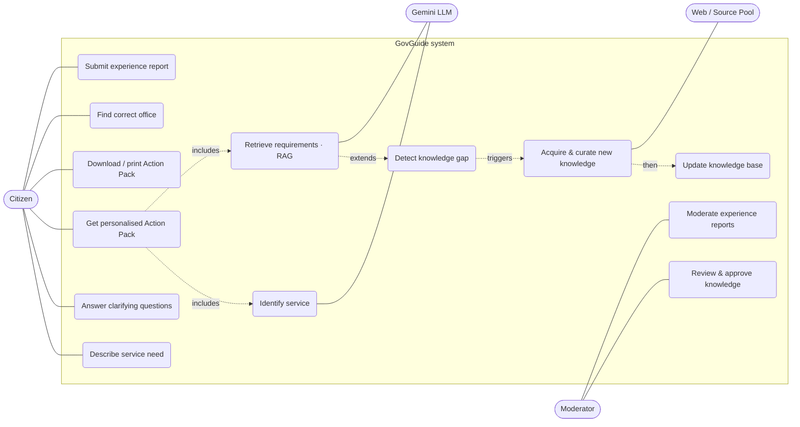

# 06 · Use Cases

> Mermaid has no native UML use-case shape; the diagram below approximates it (actors on the edges,
> use cases as rounded nodes inside the system boundary). It can be redrawn in draw.io for the final
> report — the actors, use cases, and relationships are authoritative here.

## Actors
- **Citizen** (primary) — wants to complete a government service correctly the first time.
- **Moderator / Admin** — reviews auto-gathered knowledge and experience reports.
- **LLM Provider (Gemini)** — external system actor used by the agents.
- **Web / Source Pool** — external information sources for the Research agent.

## Use-case diagram

## Key scenarios

### Scenario A — Seeded service, branching (happy path)
1. Citizen: "I inherited my father's land and want to transfer the deed to my name."
2. **A1/A2** identify *Land Deed Transfer*.
3. **A3** asks only what's needed: *inheritance/sale/gift?* → inheritance; *which district?*
4. **A4/A5** retrieve sufficient seeded knowledge.
5. **A6** returns the Action Pack: documents (incl. inheritance-specific), fees, the DS office for
   that district, and the visit sequence → printable PDF, each fact cited + `last-verified`.

### Scenario B — Unseen service (self-expanding RAG, the showcase)
1. Citizen: "How do I register a business name as a sole proprietor?"
2. **A4** retrieves little; **A5** → `GAP`.
3. **B1** searches the local source pool (then web fallback); **B2** curates records with provenance;
   **B3** writes them to the KB (`auto_gathered`).
4. Loop back → **A4/A5** now `SUFFICIENT` → **A6** answers, labelled "newly gathered, pending
   verification" with sources. The KB has grown live.

### Scenario C — Feedback loop
1. Citizen returns and submits an experience report: "They also asked for a Grama Niladhari letter."
2. Report enters the **B2 → B3** pipeline as `pending`.
3. **Moderator (UC13)** verifies → the requirement is promoted to `verified` and future citizens see
   it automatically.

## Functional requirements (traceable to use cases)
| ID | Requirement | Use case |
|---|---|---|
| FR-1 | Accept a free-text English service request | UC1 |
| FR-2 | Ask minimal clarifying questions to select a variant + district | UC2, UC7 |
| FR-3 | Return grounded, cited requirements/fees/office/timeline | UC3, UC8 |
| FR-4 | Detect insufficient knowledge and acquire it autonomously | UC9, UC10, UC11 |
| FR-5 | Produce a printable Action Pack (PDF) | UC4 |
| FR-6 | Accept and queue experience reports | UC6, UC13 |
| FR-7 | Let a moderator promote `auto_gathered` → `verified` | UC12, UC13 |
