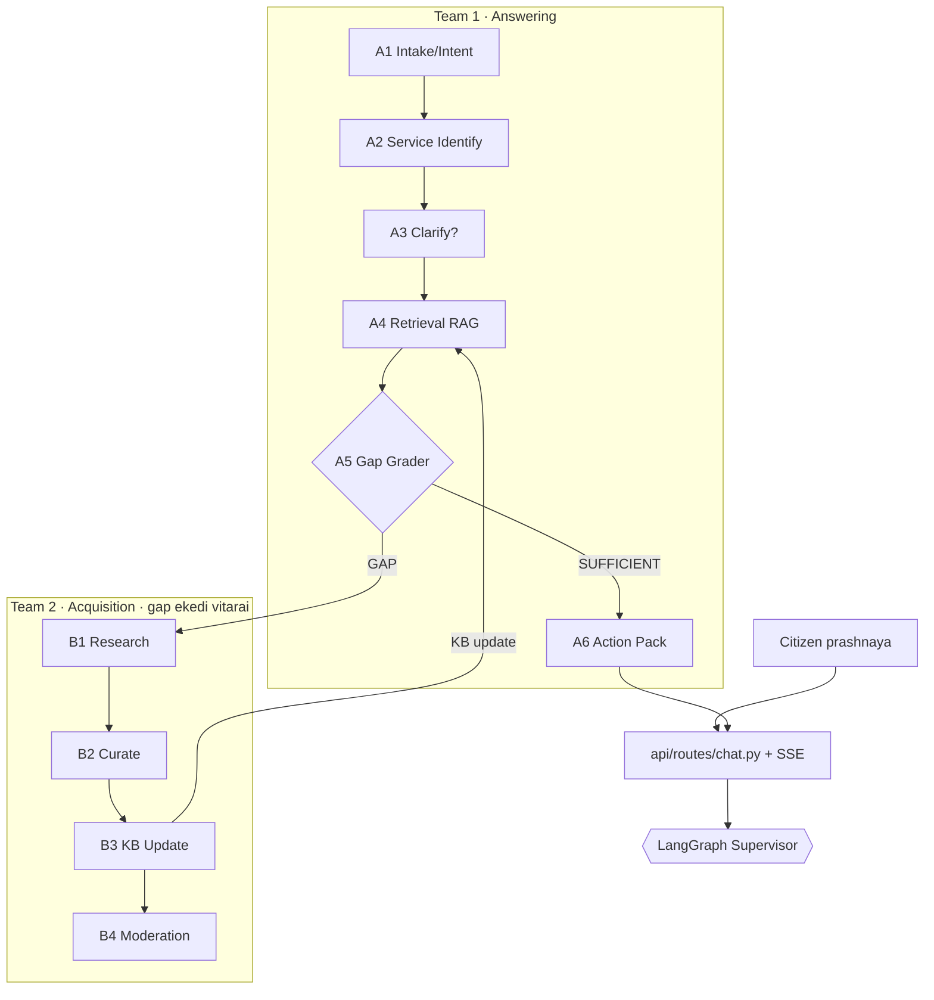

# 🧭 GovGuide / Sevana — Backend Code Walkthrough

> මේ folder එක **backend එකේ තියෙන හැම source file එකක්ම** තේරුම් ගන්න හදපු මගපෙන්වීමක් (learning guide).
> එක code file එකකට එක `.md` file එක බැගින්, code tree එකම **mirror** කරලා තියෙනවා. පැහැදිලි කිරීම්
> **සිංහලෙන් + English technical terms** වලින්. Deep design rationale එකට මුල් docs (`docs/00`–`docs/11`)
> බලන්න — මේවා ඒවාට හරස් සම්බන්ධ (cross-linked).

---

## 🚀 30 තත්පරෙන් — මේ project එක මොකක්ද?

**Sevana** කියන්නේ ශ්‍රී ලංකා **රජයේ සේවා** ගැන පුරවැසියන්ට උදව් කරන **agentic AI navigator** එකක්.
"මගේ ඉඩමේ deed එක මාරු කරගන්නේ කොහොමද?" වගේ ප්‍රශ්නයකට, අවශ්‍ය **ලියකියවිලි + ගාස්තු + කාර්යාලය +
steps** සහිත, **මූලාශ්‍ර සමඟ (cited)** "Action Pack" එකක් හදලා දෙනවා.

තාක්ෂණික හරය තුනක්:
1. **Hierarchical multi-agent system** (LangGraph) — Supervisor + teams දෙකක් (Answering `A1–A6`,
   Acquisition `B1–B4`).
2. **Self-expanding RAG** — KB එකේ නැති දෙයක් ආවොත්, system එකම web එකෙන් හොයලා, curate කරලා, KB
   එකට එකතු කරගන්නවා (ඊළඟ userට cache වෙනවා).
3. **Hexagonal architecture** — domain core එක framework වලින් නිදහස්; තාක්ෂණ (Gemini, Chroma…) හැම එකක්ම
   swap-කළ-හැකි adapters.

---

## 🏛️ Hexagonal Architecture + The Dependency Rule

මෙතන තියෙන **එකම වැදගත්ම rule එක**: **dependencies ඇතුළට විතරයි යොමු වෙන්නේ** (`domain ← application ←
adapters/api`). `domain` කිසිම දෙයක් import කරන්නේ නෑ; `application` import කරන්නේ `domain.ports` විතරයි;
`adapters` ඒ ports implement කරනවා; `api` හැම දෙයක්ම boot වෙද්දී එකට wire කරනවා.

```
        ┌─────────────────────── api/ (FastAPI, SSE, DTO) ───────────────────────┐
        │   ┌─────────────── application/ (agents A1–A6, B1–B4 + LangGraph) ───┐  │
        │   │        ┌──────────────── domain/ (PURE core) ────────────────┐   │  │
        │   │        │   entities.py  +  ports/ (6 interfaces)             │   │  │
        │   │        └──────────────────────────────────────────────────────┘   │  │
        │   └──────────────────────────────────────────────────────────────────┘  │
        └────────────────────────────────────────────────────────────────────────┘
   adapters/ ── ports implement කරනවා ──►  (llm, knowledge, embeddings, web_search, parser, source_pool)
   infrastructure/ ── cross-cutting ──►    (config, logging, llm_gateway, cache)
```

**ඇයි මේක වටිනවා?** Gemini → Groq කරන්න, හෝ Chroma → pgvector කරන්න, ඕන වෙන්නේ `adapters/` එකේ file
එකක් වෙනස් කරන එක විතරයි — agents/domain logic එකට අත ගාන්නේ නෑ. (Full rationale: [`docs/09` AD-9](../09-architecture-decisions.md).)

---

## 🔄 Request එකක ගමන (The flow)



- **සුමට path එක:** A1 → A2 → (A3 clarify) → A4 retrieve → A5 grade → A6 Action Pack.
- **Gap loop එක:** A5 කියනවා "GAP" කියලා නම් → B1 web එකෙන් හොයනවා → B2 curate → B3 KB update → නැවත A4.
  මේ loop එකට **cap එකක්** (N=2, AD-2) — නවතින්නේ නැතුව යන එක නවත්තන්න.
- **Confidence gate (τ=0.6, AD-8):** `auto_gathered` දේවල් confidence අඩුයි නම් A6 render කරන්නේ නෑ —
  graceful fallback එකක් දෙනවා.

---

## 📖 කියවන්න නිර්දේශිත පිළිවෙළ (Reading order)

මුල සිට තේරුම් ගන්න ලේසිම පිළිවෙළ (inside-out):

1. **Domain** → [`entities.md`](domain/entities.md) → [`ports/`](domain/ports/) (හදවත + sockets)
2. **Infrastructure** → [`config.md`](infrastructure/config.md), [`llm_gateway.md`](infrastructure/llm_gateway.md)
3. **Adapters** → [`knowledge/chroma_sqlite.md`](adapters/knowledge/chroma_sqlite.md), [`llm/base.md`](adapters/llm/base.md)
4. **Application** → [`graph/state.md`](application/graph/state.md) → agents `a1…a6`, `b1…b4` → [`graph/builder.md`](application/graph/builder.md)
5. **API** → [`api/runtime.md`](api/runtime.md) → [`api/routes/chat.md`](api/routes/chat.md)
6. **CLI** → [`cli/seed.md`](cli/seed.md)

---

## 🗺️ සම්පූර්ණ File Map

සම්පූර්ණ **52 source files + මේ index එක = 53 walkthrough files** ✅ ලියලා ඉවරයි. වඩාත්ම නිවැරදි reference
එක තමයි මුල් source එක — code වෙනස් වුණාම මේ walkthrough එකත් update කරන්න.

### `domain/` — Pure core (framework එකක් නෑ)
| Source | Walkthrough | මොකද කරන්නේ |
|---|---|---|
| `domain/entities.py` | ✅ [entities.md](domain/entities.md) | හැම entity/enum/value-object එකක්ම (frozen dataclasses) |
| `domain/ports/llm.py` | ✅ [llm.md](domain/ports/llm.md) | LLM reasoning socket |
| `domain/ports/embeddings.py` | ✅ [embeddings.md](domain/ports/embeddings.md) | text→vector socket |
| `domain/ports/knowledge.py` | ✅ [knowledge.md](domain/ports/knowledge.md) | KnowledgeStore + Retriever sockets |
| `domain/ports/web_search.py` | ✅ [web_search.md](domain/ports/web_search.md) | live-web socket |
| `domain/ports/parser.py` | ✅ [parser.md](domain/ports/parser.md) | PDF/HTML parse socket |
| `domain/ports/source_pool.py` | ✅ [source_pool.md](domain/ports/source_pool.md) | local pool socket |

### `infrastructure/` — Cross-cutting
| Source | Walkthrough | මොකද කරන්නේ |
|---|---|---|
| `infrastructure/config.py` | ✅ config.md | හැම setting එකක්ම (Pydantic Settings) |
| `infrastructure/logging.py` | ✅ logging.md | logging setup |
| `infrastructure/llm_gateway.py` | ✅ llm_gateway.md | rate-limit + retry + fallback (AD-10) |
| `infrastructure/cache.py` | ✅ cache.md | query→answer cache (AD-12) |

### `adapters/` — Ports implement කරන තැන්
| Source | Walkthrough | මොකද කරන්නේ |
|---|---|---|
| `adapters/embeddings/bge.py` | ✅ bge.md | local bge embeddings |
| `adapters/knowledge/schema.sql` | ✅ schema.md | SQLite schema (ER) |
| `adapters/knowledge/chroma_sqlite.py` | ✅ chroma_sqlite.md | SQLite + Chroma store |
| `adapters/knowledge/chunking.py` | ✅ chunking.md | text chunking |
| `adapters/knowledge/seed.py` | ✅ seed.md | catalog JSON → KB loader |
| `adapters/llm/base.py` | ✅ base.md | LangChain wrapper |
| `adapters/llm/gemini.py` | ✅ gemini.md | Gemini (primary) |
| `adapters/llm/groq.py` | ✅ groq.md | Groq (fallback) |
| `adapters/parser/pymupdf.py` | ✅ pymupdf.md | PDF + HTML parser |
| `adapters/source_pool/filesystem.py` | ✅ filesystem.md | local pool adapter |
| `adapters/web_search/allowlist.py` | ✅ allowlist.md | gov.lk allow-list |
| `adapters/web_search/tavily.py` | ✅ tavily.md | Tavily search |
| `adapters/web_search/ddg.py` | ✅ ddg.md | DuckDuckGo fallback |

### `application/` — Use cases (agents + LangGraph)
| Source | Walkthrough | මොකද කරන්නේ |
|---|---|---|
| `application/graph/state.py` | ✅ state.md | GraphState (blackboard) |
| `application/graph/serialization.py` | ✅ serialization.md | state ↔ domain mapping |
| `application/graph/dependencies.py` | ✅ dependencies.md | agent DI container |
| `application/graph/builder.py` | ✅ builder.md | StateGraph wiring + routing |
| `application/agents/schemas.py` | ✅ schemas.md | Pydantic structured-output schemas |
| `application/agents/a1_intake.py` | ✅ a1_intake.md | A1 Intake & Intent |
| `application/agents/a2_identify.py` | ✅ a2_identify.md | A2 Service Identifier |
| `application/agents/a3_clarify.py` | ✅ a3_clarify.md | A3 Clarification |
| `application/agents/a4_retrieval.py` | ✅ a4_retrieval.md | A4 Retrieval (RAG) |
| `application/agents/a5_grader.py` | ✅ a5_grader.md | A5 Gap Grader |
| `application/agents/a6_action_pack.py` | ✅ a6_action_pack.md | A6 Action Pack |
| `application/agents/b1_research.py` | ✅ b1_research.md | B1 Research |
| `application/agents/b2_curate.py` | ✅ b2_curate.md | B2 Extract & Curate |
| `application/agents/b3_kb_updater.py` | ✅ b3_kb_updater.md | B3 KB Updater |
| `application/agents/b4_moderation.py` | ✅ b4_moderation.md | B4 Moderation |
| `application/feedback.py` | ✅ feedback.md | experience-report use case |
| `application/moderation.py` | ✅ moderation.md | moderation use case |

### `api/` — Delivery (FastAPI + SSE)
| Source | Walkthrough | මොකද කරන්නේ |
|---|---|---|
| `api/main.py` | ✅ main.md | app factory + /health |
| `api/runtime.py` | ✅ runtime.md | adapters → gateway → graph wiring |
| `api/dependencies` (dto/session) | ✅ dto.md, session_state.md | DTOs + session store |
| `api/sse.py` | ✅ sse.md | SSE event streaming |
| `api/routes/chat.py` | ✅ chat.md | chat POST + SSE + resume |
| `api/routes/feedback.py` | ✅ feedback.md | experience-report route |
| `api/routes/moderation.py` | ✅ moderation.md | moderation queue route |

### `cli/` — Command-line tools
| Source | Walkthrough | මොකද කරන්නේ |
|---|---|---|
| `cli/__main__.py` | ✅ main.md | CLI entry |
| `cli/build_catalog.py` | ✅ build_catalog.md | catalog builder |
| `cli/seed.py` | ✅ seed.md | seed command |

---

## 🧩 එක් එක් `.md` එකේ structure එක

හැම file walkthrough එකකම මේ කොටස් තියෙනවා:
- **🎯 කාර්යය** — file එක මොකටද, ඇයි ඕන.
- **🏛️ Architecture එකේ තැන** — layer එක, මොන port/ADR එකට සම්බන්ධද.
- **🔍 Code Walkthrough** — වැදගත් class/function ටික Singlish වලින්.
- **🔗 සම්බන්ධතා** — මොනවද import කරන්නේ, කවුද මේක use කරන්නේ.
- **💡 Design decisions / ⚠️ ගොටුවෙන්න පුළුවන් තැන්.**

> **සටහන:** මෙතන explain කරන්නේ current committed code එකයි (Stages 0–6, team merge එකත් එක්ක).
